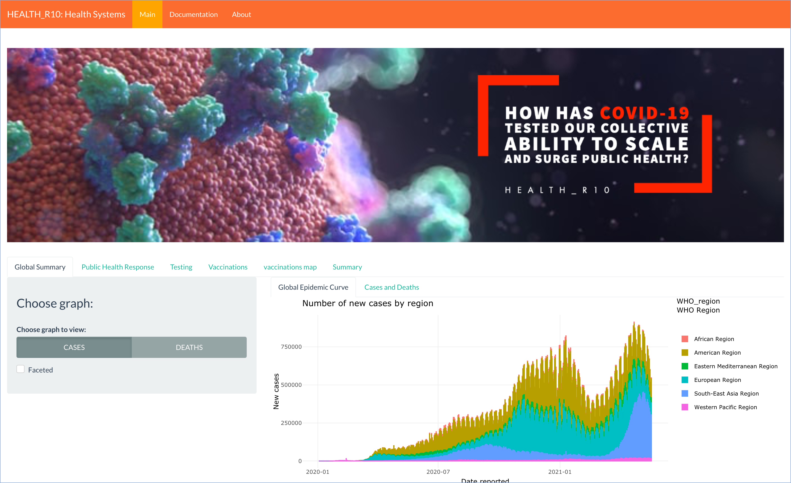

```{r global_options, include=FALSE}
knitr::opts_chunk$set(warning=FALSE)
```

# Content 

1. Brief Introduction
2. Data Sources
3. Technologies Used
4. Data Transformation
    + Main Libraries
    + Global Statistics Data Set
    + Visualizations Part 1
    + Oxford Covid-19 Government Response Tracker (OxCGRT)
    + Visualizations Part 2
    + Our World In Data (OWID) COVID-19 Testing
    + Visualizations Part 3
    + Our World In Data (OWID) COVID-19 Vaccinations
    + Visualizations Part 4
    + Summary Tab
    + Visualisations Part 5
    
5. Shiny Application
6. Deployment
7. References


## 1. Brief Introduction


## 2. Data Sources

+ Global Statistics
  - links here
+ Oxford Covid-19 Government Response Tracker (OxCGRT)
  - [Response Policy Data](https://github.com/OxCGRT/covid-policy-tracker)
+ Our World In Data (OWID) COVID-19 Testing
  - [Testing Policy Data](https://ourworldindata.org/grapher/covid-19-testing-policy)
  - [Total Test Data](https://raw.githubusercontent.com/owid/covid-19-data/master/public/data/owid-covid-data.csv)
  - [New Test Data](https://ourworldindata.org/grapher/daily-covid-19-tests-smoothed-7-day?time=2020-04-09..latest&country=~MYS)
+ Our World In Data (OWID) COVID-19 Vaccinations
  - [Continent Data](https://ourworldindata.org/grapher/continents-according-to-our-world-in-data)
  - [Vaccine Data](https://github.com/owid/covid-19-data/blob/master/public/data/vaccinations/vaccinations.csv)
  - [Region (location) data](https://github.com/owid/covid-19-data/blob/master/public/data/vaccinations/locations.csv)
  
## 3. Technologies Used


## 4. Workflow

Xing Wei's Part Here

For detailed steps on how parts were implemented, please refer to [Shiny App](https://github.sydney.edu.au/VHOA0395/HealthR_10-DATA3888)

### Libraries Used

```{r error = F, warning = F, message = F}
library(tidyverse)
library(readxl)
library(tibble)
library(janitor)
library(reshape2)
library(ggplot2)
library(ggthemes)
library(plotly)
library(pheatmap)
library(maps)
library(zoo)
library(dendextend)
library(proxy)
library(DT)
library(lubridate)
library(forecast)
library(readr)
library(fpp2)
library(sparkline)
library(TTR)
library(tseries)
```


### Global Summary

In our **Global Summary** Tab, there have 2 tabs which provide the user a look at the **Global Epidemic Curve** and the **Cases and Deaths**.

In **Global Epidemic Curve**, we allow the user to view the Number of Cases and Deaths by Region. 


Next, in **Cases and Death** 


### Public Health Response

### Testing

### Vaccinations

### Summary (tab)


